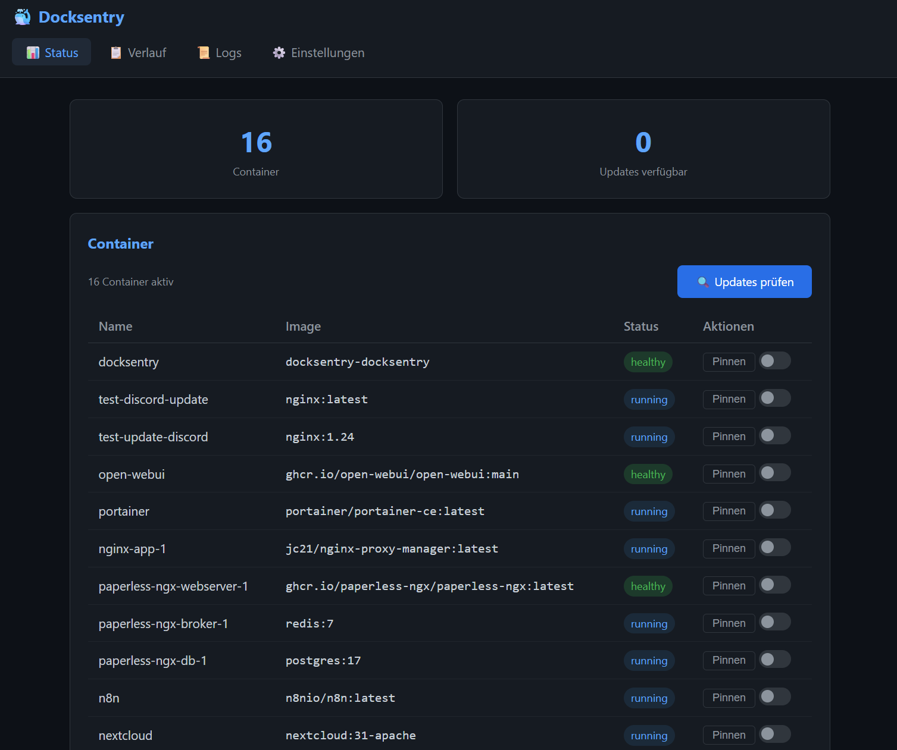
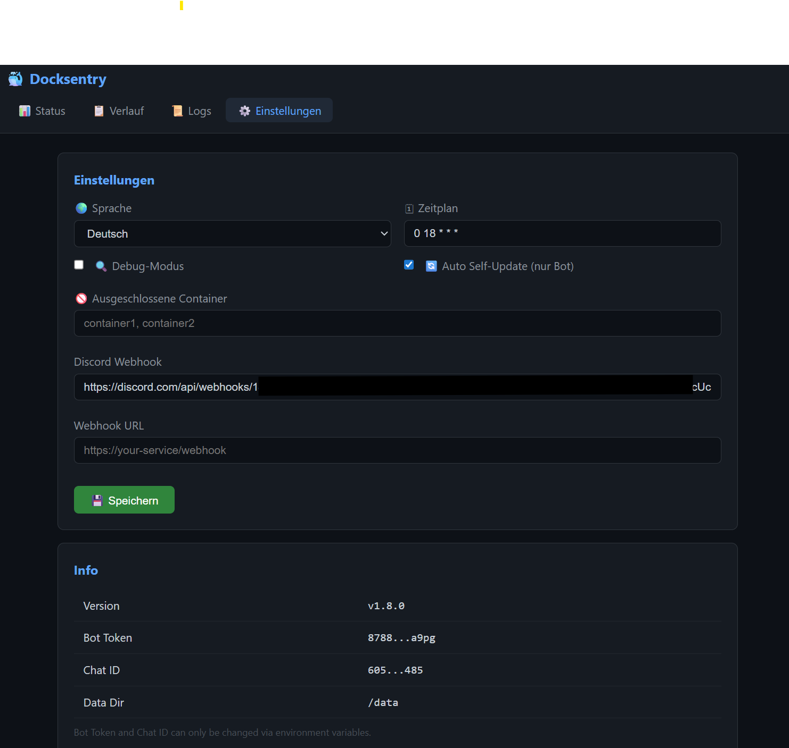

# Docksentry 🐳

Your Docker container watchdog — monitors images for updates and lets you manage them via Telegram, with Web UI, auto-rollback, and multi-language support.


<p align="center">
  
  
</p>

## Features

- **Automatic update detection** — compares local and remote image digests on a configurable cron schedule
- **Telegram notifications** — get notified when updates are available, with inline action buttons
- **Per-container or bulk updates** — update individual containers or all at once
- **Per-container auto-update** — selected containers update automatically without confirmation (`/autoupdate`)
- **Pin/Freeze containers** — exclude containers from updates via Telegram (`/pin`, `/unpin`)
- **Partial name matching** — type just the beginning of a container name (e.g. `/pin ngi` → `nginx`)
- **Update history** — persistent log of all updates, viewable via `/history` or the Web UI
- **Health check after update** — verifies the container is running (and healthy) after recreation
- **Auto-rollback** — failed updates or health checks automatically restore the previous container
- **Docker Compose support** — detects Compose stacks and uses native `docker compose pull/up` for updates
- **Self-update** — the bot can update itself via `/selfupdate` or automatically with `AUTO_SELFUPDATE=true`
- **Cleanup** — remove old unused images via `/cleanup`
- **Debug mode** — toggle detailed diagnostics via `/debug`
- **Multi-language** — 16 languages included, switch via `/lang` or add your own
- **Optional Web UI** — dashboard with status, history, and settings, password-protected
- **Works with and without Docker Hub login** — credentials are optional
- **Lightweight** — Python standard library only, no extra dependencies
- **Docker-native** — runs as a container, manages containers via Docker socket

## Quick Start

### 1. Create a Telegram Bot

1. Message [@BotFather](https://t.me/BotFather) on Telegram
2. Send `/newbot` and follow the instructions
3. Copy the bot token

### 2. Get your Chat ID

Send a message to your bot, then open:
```
https://api.telegram.org/bot<YOUR_TOKEN>/getUpdates
```
Look for `"chat":{"id":YOUR_CHAT_ID}` in the response.

### 3. Run the container

```bash
docker run -d \
  --name docksentry \
  --restart unless-stopped \
  -e BOT_TOKEN=your-bot-token \
  -e CHAT_ID=your-chat-id \
  -v /var/run/docker.sock:/var/run/docker.sock \
  amayer1983/docksentry:latest
```

That's it — the bot will check for updates daily at 18:00 and notify you via Telegram.

### Docker Compose / Portainer Stack

```yaml
services:
  docksentry:
    image: amayer1983/docksentry:latest
    container_name: docksentry
    restart: unless-stopped
    environment:
      - BOT_TOKEN=your-bot-token
      - CHAT_ID=your-chat-id
      - CRON_SCHEDULE=0 18 * * *
      - TZ=Europe/Berlin
    volumes:
      - /var/run/docker.sock:/var/run/docker.sock
      - docksentry_data:/data
    security_opt:
      - no-new-privileges:true

volumes:
  docksentry_data:
```

### With Docker Hub login (optional, avoids rate limits)

Run `docker login` on your host first, then add this volume:

```yaml
    volumes:
      - /var/run/docker.sock:/var/run/docker.sock
      - docksentry_data:/data
      - /root/.docker/config.json:/.docker/config.json:ro
```

## Telegram Commands

<p align="center">
  
  
</p>

### Updates & Monitoring

| Command | Description |
|---------|-------------|
| `/check` | Manually trigger an update check |
| `/status` | Show all running containers and their status |
| `/updates` | Show pending updates |
| `/history` | Show update history (last 10 entries) |

### Container Management

| Command | Description |
|---------|-------------|
| `/pin <name>` | Pin a container — excluded from updates. Without name: show pinned list |
| `/unpin <name>` | Unpin a container — included in updates again |
| `/autoupdate <name>` | Toggle auto-update for a container — updates without confirmation. Without name: show list |
| `/cleanup` | Remove old unused Docker images |

### Bot Management

| Command | Description |
|---------|-------------|
| `/selfupdate` | Update the bot itself to the latest version |
| `/debug` | Toggle debug mode for detailed diagnostics |
| `/lang <code>` | Switch language (e.g. `/lang en`, `/lang de`) |
| `/settings` | Show current configuration |
| `/help` | Show available commands and version |

> **Partial name matching:** You don't need to type the full container name. `/pin ngi` will match `nginx` if it's the only container starting with "ngi". If multiple containers match, the bot shows all options.

## Update Workflow

<p align="center">
  
</p>

When updates are found, you receive a Telegram message with image sizes, dates, and action buttons:

```
🔄 Docker Updates Available

• nginx (nginx:latest)
  📦 141 MB | 📅 Current: 2026-03-15
• redis (redis:7)
  📦 117 MB | 📅 Current: 2026-03-20

[🔄 nginx (141 MB)]
[🔄 redis (117 MB)]
[🚀 Update all] [✋ Manual]
```

- **Individual buttons** — update a single container, button changes to ✅ when done
- **🚀 Update all** — pull and restart all containers at once
- **✋ Manual** — dismiss and handle updates yourself

### What happens during an update

1. The bot pulls the new image
2. Stops the old container and renames it as backup
3. Recreates the container with the same configuration (ports, volumes, environment, labels, networks)
4. Runs a **health check** — waits up to 30 seconds, verifying the container is running (and healthy, if a Docker HEALTHCHECK is defined)
5. On success: removes the backup and logs the update to history
6. On failure: **automatically rolls back** to the previous container

### Auto-update mode

Containers set to auto-update (`/autoupdate nginx`) are updated automatically during scheduled checks — no button press needed. The bot sends a summary after completion. All other containers still show the usual notification with buttons.

### Pinned containers

Pinned containers (`/pin nginx`) are completely excluded from update checks. Use this for containers you want to keep on a specific version. Unpin anytime with `/unpin nginx`.

## Configuration

| Variable | Default | Description |
|----------|---------|-------------|
| `BOT_TOKEN` | *required* | Telegram Bot API token |
| `CHAT_ID` | *required* | Your Telegram chat ID |
| `CRON_SCHEDULE` | `0 18 * * *` | Cron expression for scheduled checks |
| `EXCLUDE_CONTAINERS` | | Comma-separated container names to permanently exclude |
| `AUTO_SELFUPDATE` | `false` | Automatically update the bot on each scheduled check |
| `LANGUAGE` | `en` | Bot language (see [Multi-Language](#multi-language)) |
| `WEB_UI` | `false` | Enable optional web dashboard |
| `WEB_PORT` | `8080` | Web UI port (inside container) |
| `WEB_PASSWORD` | | Password for Web UI (Basic Auth). Leave empty for no protection |
| `TZ` | `Europe/Berlin` | Timezone for scheduling |
| `DOCKER_HOST` | | Docker API endpoint (e.g. `tcp://socket-proxy:2375` for socket proxy) |

### Cron Schedule Examples

| Schedule | Description |
|----------|-------------|
| `0 18 * * *` | Daily at 18:00 |
| `0 9,18 * * *` | Twice daily at 9:00 and 18:00 |
| `0 18 * * 1-5` | Weekdays at 18:00 |
| `*/30 * * * *` | Every 30 minutes |

### Excluding containers

There are two ways to exclude containers from updates:

| Method | How | Persistent | Use case |
|--------|-----|-----------|----------|
| `EXCLUDE_CONTAINERS` env var | Set at container start | Across restarts | Permanently exclude containers |
| `/pin` command in Telegram | Send `/pin <name>` | Saved to data volume | Temporarily freeze a container version |

## Web UI (Optional)

Enable a lightweight web dashboard for status overview, update history, and settings:

```bash
docker run -d \
  --name docksentry \
  -e BOT_TOKEN=your-bot-token \
  -e CHAT_ID=your-chat-id \
  -e WEB_UI=true \
  -e WEB_PASSWORD=your-secret \
  -p 8080:8080 \
  -v /var/run/docker.sock:/var/run/docker.sock \
  amayer1983/docksentry:latest
```

The Web UI is **disabled by default** to keep the container minimal. When enabled, it provides:

- **Status page** — live container overview with health badges and pending update count
- **History page** — full update log with timestamps, results, and details
- **Settings page** — change language, debug mode, and auto-selfupdate via browser
- **Update check** — trigger a check from the dashboard

The Web UI is fully translated — it follows the configured language.

<p align="center">
  
</p>
<p align="center">
  
</p>
<p align="center">
  
</p>

Access it at `http://your-server:8080` with the configured password.

## Multi-Language

16 languages are included out of the box:

🇬🇧 English · 🇩🇪 Deutsch · 🇫🇷 Français · 🇪🇸 Español · 🇮🇹 Italiano · 🇳🇱 Nederlands · 🇧🇷 Português · 🇵🇱 Polski · 🇹🇷 Türkçe · 🇷🇺 Русский · 🇺🇦 Українська · 🇸🇦 العربية · 🇮🇳 हिन्दी · 🇯🇵 日本語 · 🇰🇷 한국어 · 🇨🇳 中文

**Switch language:**
- Via Telegram: `/lang de`, `/lang fr`, etc.
- Via Web UI: Settings page
- Via environment variable: `LANGUAGE=de`

**Missing your language or found a translation error?** Open an [issue](https://github.com/amayer1983/docksentry/issues) or submit a pull request — contributions are welcome!

**Add your own language:**

Create a JSON file in the `lang/` directory (e.g. `sv.json` for Swedish) with all translation keys. Use `en.json` as a template. The bot picks up new files automatically — no code changes needed. You can also mount a custom lang directory:

```yaml
volumes:
  - ./my-languages:/app/lang
```

## Docker Compose Support

The bot automatically detects containers managed by Docker Compose via container labels. When updating a Compose-managed container, the bot uses the native Compose workflow:

1. `docker compose pull <service>` — pulls the new image
2. `docker compose up -d --no-deps <service>` — recreates only the updated service
3. Health check and automatic rollback on failure

This preserves all Compose-specific configuration (depends_on, networks, deploy settings) that would be lost with a plain `docker run` recreation.

**Requirements:** The Compose file must be accessible from inside the bot container. Mount the directory containing your `docker-compose.yml`:

```yaml
volumes:
  - /var/run/docker.sock:/var/run/docker.sock
  - docksentry_data:/data
  - /path/to/your/stacks:/stacks:ro
```

If the Compose file is not accessible (e.g. Portainer-managed stacks stored in a database), the bot automatically falls back to the standard `docker run` recreation method.

Compose-managed containers are marked with a 🐳 icon in update notifications.

## How It Works

1. On the configured schedule, the bot compares local image digests with remote registry digests via the Docker Registry HTTP API
2. Pinned containers and containers in `EXCLUDE_CONTAINERS` are skipped
3. If updates are found, containers on the auto-update list are updated immediately
4. Remaining updates are sent as a Telegram notification with inline action buttons
5. When you press update, the bot uses **Docker Compose** (if detected) or **docker run** to recreate the container, then runs a health check
6. If recreation or health check fails, the old container is automatically restored (rollback)
7. All updates (success and failure) are logged to the update history

## What Gets Skipped

- The bot's own container (use `/selfupdate` instead)
- Containers running with image IDs instead of tags (locally built images)
- Containers in the `EXCLUDE_CONTAINERS` list
- Pinned containers (`/pin`)

## Docker Hub Rate Limits

| | Update checks | Image pulls |
|---|---|---|
| **Without login** | Unlimited (uses registry API) | 100 per 6 hours |
| **With login** | Unlimited | Unlimited |

Update checks use the registry API and do **not** count against pull limits. For most setups without login, the rate limit is not an issue.

If the credentials file doesn't exist, simply leave out the volume mount — the bot works fine without it.

## Security

- Only the configured `CHAT_ID` can interact with the Telegram bot
- `no-new-privileges` security option recommended
- Zero external dependencies — Python standard library + Docker CLI only (no supply-chain risk)
- Docker credentials mounted read-only
- Web UI password hashed (SHA-256), never stored in plain text

### Docker Socket Proxy (recommended)

Direct access to the Docker socket (`/var/run/docker.sock`) grants root-equivalent permissions on the host. This applies to **all** container management tools (Portainer, Watchtower, etc.), not just Docksentry.

For production environments, use a **Docker Socket Proxy** to restrict API access to only the endpoints Docksentry needs:

```yaml
services:
  socket-proxy:
    image: ghcr.io/tecnativa/docker-socket-proxy:latest
    container_name: socket-proxy
    restart: unless-stopped
    privileged: true
    environment:
      POST: 1           # Required for pull, rename, remove
      CONTAINERS: 1     # List, inspect, stop, start, rename, remove
      IMAGES: 1         # Pull, inspect, prune
      ALLOW_START: 1    # Start containers
      ALLOW_STOP: 1     # Stop containers
    volumes:
      - /var/run/docker.sock:/var/run/docker.sock:ro
    networks:
      - docksentry-internal

  docksentry:
    image: amayer1983/docksentry:latest
    container_name: docksentry
    restart: unless-stopped
    environment:
      - BOT_TOKEN=your-bot-token
      - CHAT_ID=your-chat-id
      - DOCKER_HOST=tcp://socket-proxy:2375
      - TZ=Europe/Berlin
    depends_on:
      - socket-proxy
    networks:
      - docksentry-internal
    # No docker.sock mount needed!
    volumes:
      - docksentry_data:/data
    security_opt:
      - no-new-privileges:true

networks:
  docksentry-internal:
    driver: bridge

volumes:
  docksentry_data:
```

**What this blocks:** Exec into containers, volume/network management, Swarm/secrets access, image builds — only container lifecycle and image pull/inspect are allowed.

> **Alternative:** [linuxserver/socket-proxy](https://github.com/linuxserver/docker-socket-proxy) is a drop-in replacement with the same environment variables and rootless support.

### Web UI with HTTPS (Reverse Proxy)

The built-in Web UI uses HTTP. For secure remote access, put it behind a reverse proxy with TLS.

**Nginx Proxy Manager / Caddy / Traefik:**

```yaml
  docksentry:
    # ...
    labels:
      # Traefik example
      - "traefik.enable=true"
      - "traefik.http.routers.docksentry.rule=Host(`docksentry.yourdomain.com`)"
      - "traefik.http.routers.docksentry.entrypoints=websecure"
      - "traefik.http.routers.docksentry.tls.certresolver=letsencrypt"
      - "traefik.http.services.docksentry.loadbalancer.server.port=8080"
```

**Caddy (Caddyfile):**

```
docksentry.yourdomain.com {
    reverse_proxy docksentry:8080
}
```

> **Tip:** When using a reverse proxy, don't expose port 8080 directly — remove the `-p 9090:8080` mapping and let the proxy handle external access.

### Security Checklist

| Measure | Priority | How |
|---------|----------|-----|
| Docker Socket Proxy | High | See example above |
| HTTPS for Web UI | High | Reverse proxy with TLS |
| Strong Web UI password | Medium | `WEB_PASSWORD=...` (hashed internally) |
| `no-new-privileges` | Medium | `security_opt` in compose |
| Private network | Medium | Internal Docker network for proxy |
| Rotate Telegram bot token | Low | Revoke via @BotFather if compromised |
| Docker Hub login | Low | Avoids rate limits, credentials read-only |

## License

MIT License - see [LICENSE](LICENSE)
